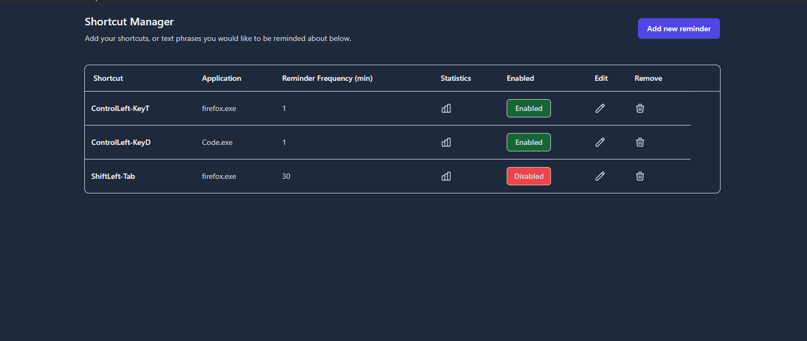
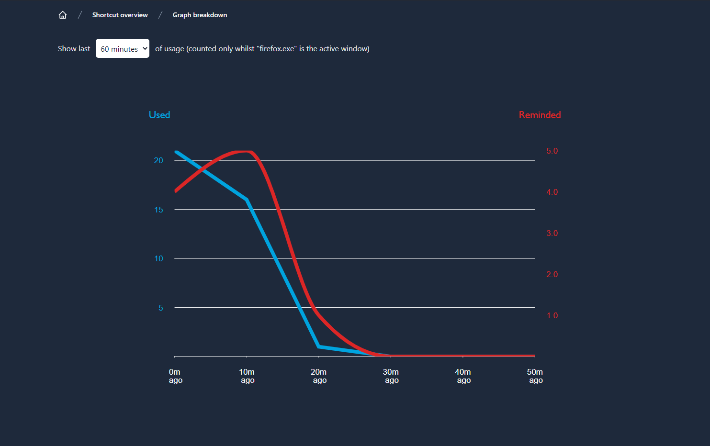
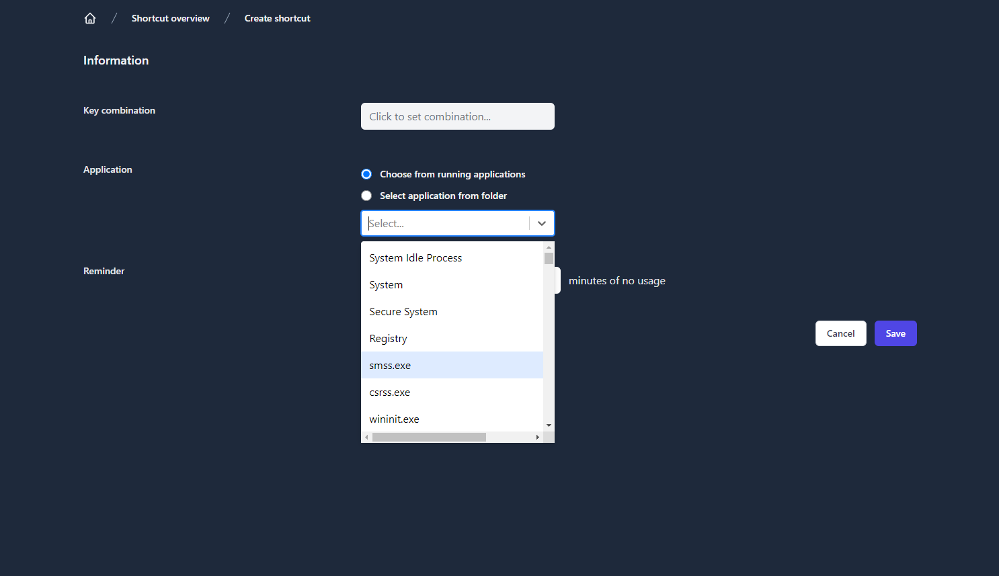
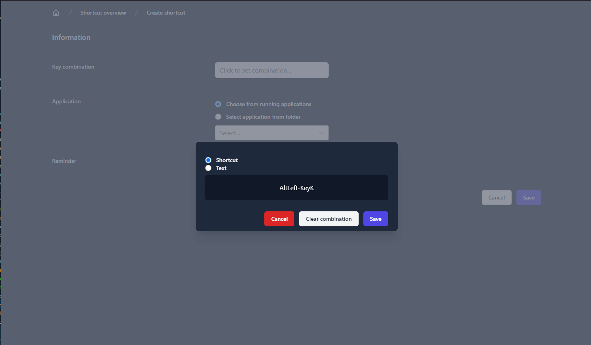

<a href="https://www.patreon.com/user?u=79999206"> </a>
## Overview

A tool to help you remember shortcuts across any application.

Shortcutmon allows you to define a shortcut (or alternatively a "key combination" / "phrase" - good for things like remembering to use snippets), an application (E.G "Chrome.exe"), and a time frame you wish to be notified after (E.G "10 minutes").

Given you have not used the shortcut within the application, within those X minutes, you will receive a notification reminding you to use it (with the ability to temporarily disable notifications if you need).

You can also view usage statistics for any given key combination.

## Supported operating systems
Unfortunately only windows is supported on initial release, with plans to build for mac + linux soon.

## Privacy

All data is stored locally, no external calls are made within this application.

A small cache of recent keypresses is stored in memory only to detect when a shortcut is used.


## Screenshots





## Roadmap

- Get build working across multiple platforms (tested on windows currently), the main issue is with some of the native modules (namely `electron-active-window` and `uiohook-napi`).
- Add collections of useful shortcuts for specific applications, in order to easily populate your shortcut list.
- Time of day filtering, if you have for example some shortcuts you only use during work hours.
- Log in support, to sync across
- Build extensions for chrome / vscode that can integrate with shortcutmon, in order to provide more granular detail (E.G are we working on a specific language, if so we may only want to activate shortcuts when we're working on a particular language in VS Code)
- Tidy up code base further (add tests, migrate entirely to ipcRenderer messaging from the client).

## Contributing

In the project directory, you can run:

### `yarn dev`

Runs the app in the development mode.

- We build `./server` into `./build` using tsc (allows us to use ES6 modules, which electron does not support natively - see notes).
- We start a local dev server for the frontend (using CRA) on localhost:3000.

We now ask electron to start the app using the `./build` folder as the root, and serve the http://localhost:3000 in the webview.

This means hot reloading works for the client (as we're using CRA dev server), however the server must be-built on change. We should use some combination of nodemon to monitor `/server` and re-build + re-run just the server on change in the future.


### `yarn electron-pack`

- We build `./server` into `./build`
- We build our `./src` CRA into `./build/`

We now ask [Electron Builder](https://www.electron.build/) to package our app via `electron-pack`, with `build/server/electron.js` as the entry point.

```
  "build": {
    "extraMetadata": {
      "main": "build/server/electron.js"
    }
  }
 ```

Electron-builder will then builds the app for the current platform & architecture into `dist`.


## Notes
- Electron does not support ES6 modules, only commonJS, which is why we must transpile the TS files into JS, before allowing the electron process to run it (typically we'd use ts-ignore, or just node with --experimental-modules, but this is not supported by electron).
- I've encountered an intermittent issue when building, whereby `electron-active-window` was not generating binaries for electron or windows. Removing the `"postinstall": "electron-builder install-app-deps" from package.json before installing the native module allowed the windows binary to install correctly.

## Support

If there's anything you'd like to see, or any issues you encounter, please feel free to raise an issue on github, or even better, submit a PR! Alternatively if you just want to chat about the project, or just say hi, feel free to join the discord server (https://discord.gg/G6XGA64yP7).

To support more things like this being made, please consider becoming a patreon (https://www.patreon.com/user?u=79999206).
